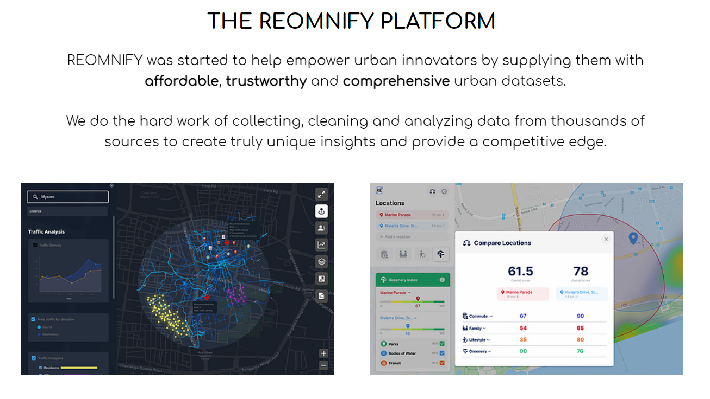

# About Me

My name is Austin Ulfers and I am a 2021 graduate from the University of Washington. I graduated with a degree in Informatics with a specialized in data science. I am currently working for Moss Adams as a Senior Software Engineer building equity management systems for the magnificent seven. I also founded a profitable company called [Roundnet AI](https://roundnet.ai) that uses computer vision to track player stats in the sport of roundnet.

# Portfolio / Finished Projects

Tags are included for all projects:

## Tracking Player Stats using AI for Roundnet.

|Description|
|:--|
|I will outline my near production ready infrastrucutre for tracking stats of players & teams in the sport of roundnet. This include combining the use of several computer vision models to track players, the ball, and the net. I will also include some of the challenges I faced and how I overcame them. Afterwards, I will discuss the current state of the application and what I plan to do next. [Learn More](https://roundnet.ai) - **November 2022**|

## Carnagie Mellon Computer Vision Capstone

|Certificate|Description| 
|:--|:--|
||This was a capstone project for CMU's computer vision certification course. Given my previous experience with computer vision in the sport of Roundnet, I decided to use what I’ve learned to create a proof-of-concept tool that can determine where a ball hits the net and translate that to a top-down view of the net. [Learn More](https://github.com/austinulfers/austinulfers/blob/main/docs/Carnegie%20Mellon%20Computer%20Vision%20Course%20Capstone%20Writeup.pdf) - **May 2022**|

## Using a Faster R-CNN to Track Objects for the Sport of Roundnet.

|Description|
|:--|
|This project outlines the process for tracking a roundnet ball within a video using Facebook’s Detectron2 Faster R-CNN model with transfer learning. Once objects within the video are classified, a series of algorithms and machine learning operations are performed to determine the active ball within a video of a single roundnet round. Through these operations, generalizable tracking was successfully established but further work is needed to implement analytics tracking on a per-player basis. [Learn More](https://roundnet.ai) - **November 2021**|

## Arrived Homes Acquisition Assistant

|Description|
|:--|
|This was our group's capstone project for the University of Washington's Informatics program. For this project we worked with Arrived Homes (arrivedhomes.com) in order to build an internal tool to aide the acquisitions team in finding properties for them to invest in. The project consisted of a Python web-scraper to get active real estate listings, various Python calculators, a TSQL database to store relevant property information, a Python Django middleware API and a JavaScript React employee facing front-end. [Learn More](https://arrived-homes-capstone.github.io/landingpage/) - **May 2021**|

## Boeing Advanced Research Center - Titanium CT Imagery Defect Analysis

|Description|
|:--|
|For this project, I worked with UW's Boeing Advanced Research Center to help categorize and predict the failure rates of various titanium alloys based on material defects created during manufacturing as seen from CT-Scans. [Learn More](https://github.com/austinulfers/austinulfers/blob/main/docs/BARC%20Writeup.md) - **December 2020**|

## Guide to Migrating Chrome Web Scrapers Within Azure

|Description|
|:--|
}Within this medium post, I created a guide on how to migrate a chrome based web-scraper to an Azure virtual machine. I step the reader through the steps necessary to both setup the environment and automate the scraper to run periodically. [Learn More](https://medium.com/swlh/guide-to-migrating-automating-chrome-web-scrapers-within-azure-909a4203476a?source=friends_link&sk=ca6117f431e3eef91ad0a65487343426). - **August 2020**|

## Reomnify Internship

|Description|
|:--|
|At this internship with Reominfy, I was tasked with two major projects. The first was being able to get a forest density index based on satellite imagery for any lat/long in the world. The second was using cellular phone tracking data to make groupings of gps pings to find popularity indexes for shopping malls in Singapore. [Learn More](https://github.com/austinulfers/austinulfers/blob/main/docs/REOMNIFY%20Final%20Presentation.pdf) - **June 2020**|

## Tracking a Roundnet Ball From an Aerial View

|Description|
|:--|
|Within this project my goal was to to track a roundnet ball from an overhead drone view in an attempt to begin tracking sports analytics for the sport of roudnet. This project sparked more ideas to continue development in this area. [Learn More](https://austinulfers.github.io/roundnet-ai-showcase/assets/html/version_one.html) - **March 2020**|

## American Classic Homes Internship

|Description|
|:--|
|My main project while working at American Classic Homes was building a series of web scraping applications to track the active supply of real estate properties within the greater Seattle area. By tracking our competitors that were buying land, I created an algorithm to estimate the projected completion date based on public permitting data. This analysis allowed me to find upcoming and growing market areas as well as establish data backed trends for the current market outlook. [Learn More](https://github.com/austinulfers/austinulfers/blob/main/docs/Final%20Market%20Report%20Summer%202019.pdf) - **August 2019**|

## Scraping My University's Course Evaluation Catalog

|Description|
|:--|
|For this project, I built a webscraper to scrape my University's poorly visualized course evaluation catalog. As a freshman, I wanted an easier way to find classes to take so after aggregating the data into one source, I created a tableau workbook to filter down the data to my criteria in order to find highly-rated classes. [Learn More](https://public.tableau.com/views/UWTableauCatalog/UWClassDashboard?:language=en-US&:display_count=n&:origin=viz_share_link) - **February 2018**|

# Activity

