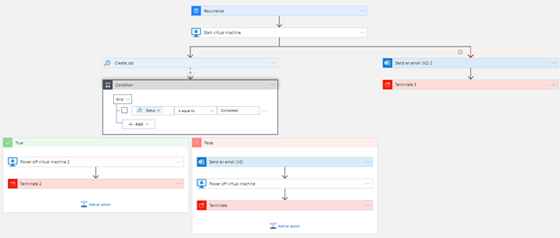
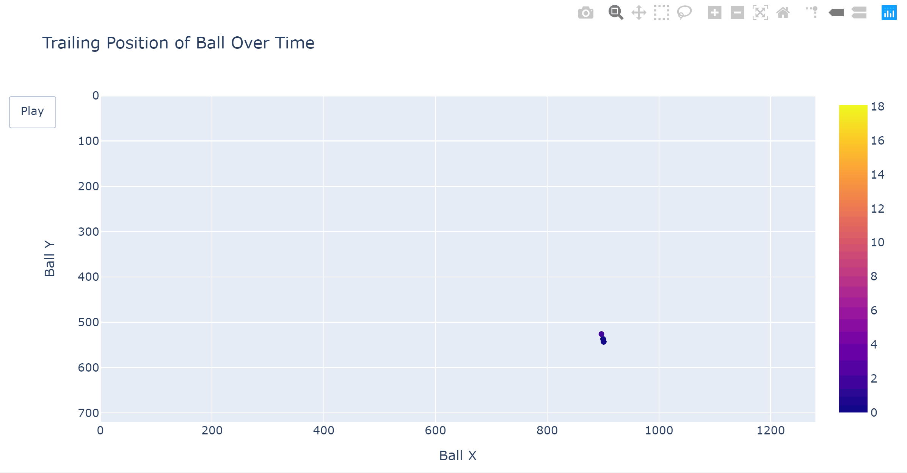

# About Me

My name is Austin Ulfers and I am a current senior at the University of Washington studying Informatics with a specialized track in data science. I am currently working for PACCAR Inc as a Data Engineer Intern.

## Finished Projects

### Guide to Migrating Chrome Web Scrapers Within Azure

Within this medium post, I created a guide on how to migrate a chrome based web-scraper to an Azure virtual machine. I step the reader through the steps necessary to both setup the environment and automate the scraper to run periodically. [Link](https://medium.com/swlh/guide-to-migrating-automating-chrome-web-scrapers-within-azure-909a4203476a?source=friends_link&sk=ca6117f431e3eef91ad0a65487343426). - August 2020

### Tracking a Spikeball From an Aerial View

Within this project my goal was to to track a Spikeball from an overhead drone view in an attempt to begin tracking sports analytics for the sport of roudnet. This project sparked more ideas to continue development in this area. [Link](https://austinulfers.github.io/spikeball-tracking/) - March 2020

### Scraping my University's Course Evaluation Catalog

For this project, I built a webscraper to scrape my University's poorly visualized course evaluation catalog. As a freshman, I wanted an easier way to find classes to take so after aggregating the data into one source, I created a tableau workbook to filter down the data to my criteria in order to find highly-rated classes. [Link](https://public.tableau.com/views/UWTableauCatalog/UWClassDashboard?:language=en-US&:display_count=n&:origin=viz_share_link) - February 2018

## Languages

