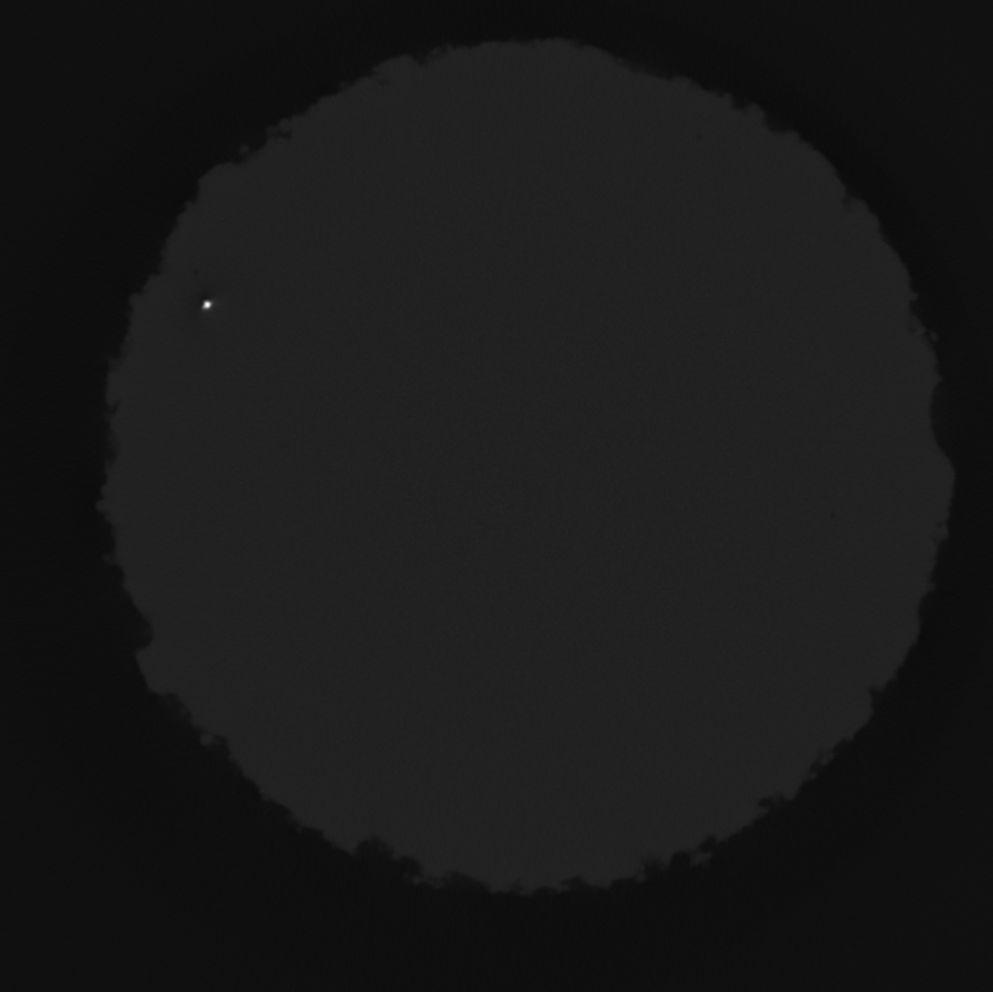
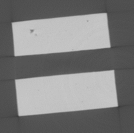
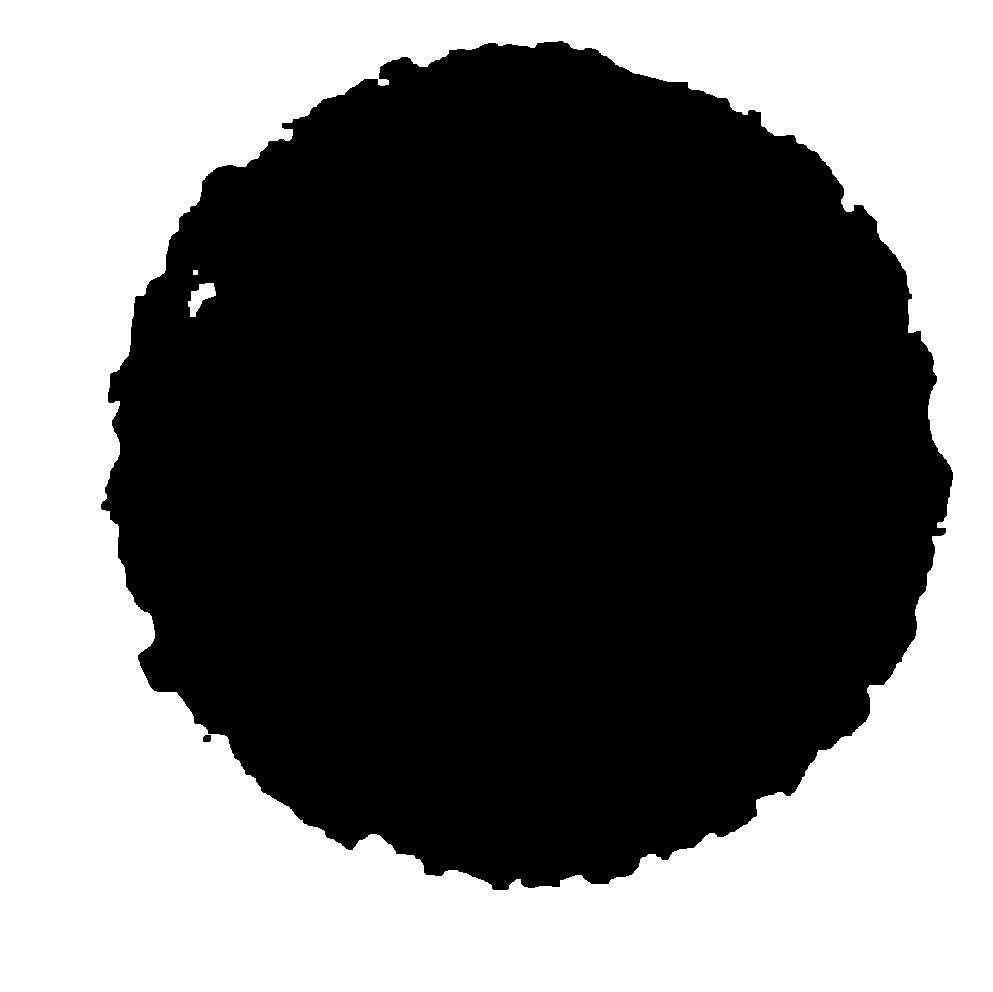
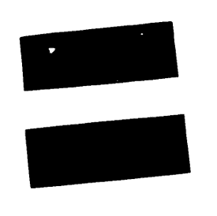
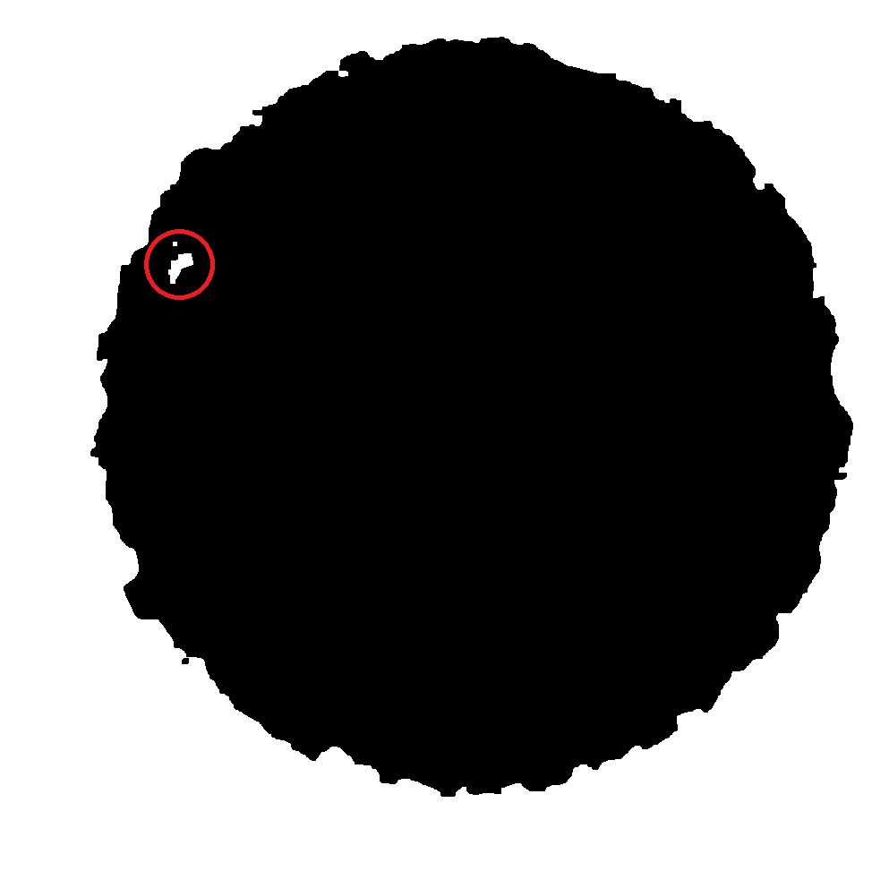
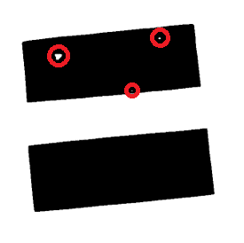

# Boeing Advanced Research Center (BARC) Project Writeup

By: Austin Ulfers

Mentor: Sean Ghods

Project Supervisor: Hsien-Lin (Stacey) Huang

## Abstract

For this project, I worked with UW's Boeing Advanced Research Center to help categorize and predict the failure rates of various titanium alloys based on material defects created during manufacturing as seen from CT-Scans.

## Research

All methodology principiles were based off several research papers and various industry specfic experts.

1. [The Influence of Porosity on Fatigue Crack Initiation in Additively Manufactured Titanium Components](https://www.nature.com/articles/s41598-017-06504-5) - August 4th 2017

2. [The Nature of Tensile Ductility as Controlled by Extreme-Sized Pores in Powder Metallurgy Ti-6Al-4V Alloy](https://link.springer.com/article/10.1007/s11661-016-3419-5) - March 4th 2016

## The Challenge

Although I had no material sciences experience prior to working on this project, I was brought on to help implement a python based solution for automatically analyzing layers of titanium CT-scans based on the findings from the above research papers. 

**The challenge was for me to try and build an application that could predict various features of manufactured titanium material based on the defects within the material.**

These defects caused the alloy material to be weaker and my job was to figure out what aspects of these defects contributed to this weakness. In theory, if we could more easily predict when an alloy would fail, Boeing could use this information to manufacture parts from scanned alloy that is designed to withstand the predicted strength in hopes to reduce part failure before a part is even assembled on the airplane.

## Methodology

Below are some example images for what some of the original ct-scan images look like:

As you can see from the above images, depending on the sample, the ct-scans varied greatly between shapes, sizes, and contrast levels. All of which needed to be normalized in oder to identify the defects within each scan layer.

Luckily one constant between each sample was that the higher brightness areas represented the target area so we knew we could ignore everything outside of the the sample.

### Image Thresholding

For this project, I used Python's OpenCV library in order to handle all of the image processing and thresholding. After testing various thresholding methods, I found that *Otsu's Binarization* thresholding method worked the best for what I was trying to achieve.

After performing this thresholding and some other minor image correction adjustments, below are the masked images created after thresholding.

The benefits of using OpenCV for this application is because it keeps track of the shape contours & polygons for each object in each image. This allowed me to parse from these images which contours were defects, and which were either noise or the larger target area.

After finding each defect per layer, we recorded specific measurements about the defects that we're relevant to the KPIs of the project. 

Now that we are able to identify defects within a single layer, we now had to repeat this process for every layer in every sample. 

### Grouping Defects Between Layers

Once that was complete, the next job was to be able to connect individual contours between layers so we knew how many layers a single defect existed in. Below is a visualized representation of what had to happen in order to group defects between layers.

When the grouping of defects between layers occurs, it was important to aggregate and extrapolate the KPI measurements taken on the layer specific level so that each defect had measurements that included all of the information recorded from each individual layer.

Now that we have a consistent and automated way of finding each defect within a stack of CT-scan images for each material sample, it was important to visualize the data and and discover which defects might have the largest impact on material strength.

### Data Visualizations

The below visualization illustrates all defects in 3D space for a sample. Color corresponds to the volume of the defect.

Similar to the above visualization, this next one shows just the x and y plane while the z plane shows the largest defects.

A top down & flattened perspective.

Lastly, it was important to be able to see what some of the defects looked like if they were recreated in 3D space. So the next visualization shows one of the largest defects from one sample so the team could get a 3D visualization on what the defect looks like.

This reconstruction was done by taking the individual contour layers of each defect layer and recreating the contour as a series of polygons in 3D space. 

## References

1. [*"OpenCV: Image Thresholding"*](https://docs.opencv.org/master/d7/d4d/tutorial_py_thresholding.html)